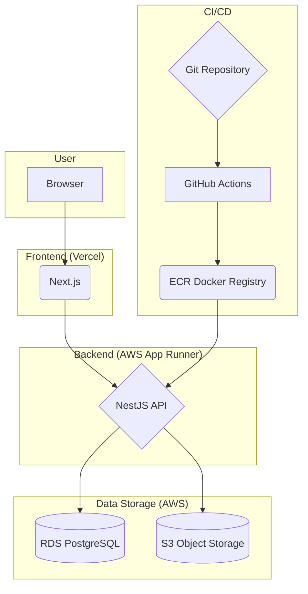

# 프로젝트 문서

## 1. 프로젝트 개요

이 문서는 **스포츠 굿즈 판매 사이트** 프로젝트의 아키텍처, 코드 구조, 실행 방법 및 팀 역할에 대해 안내합니다.

## 2. 아키텍처 다이어그램



### 설명

1.  **User (Browser)**: 사용자는 웹 브라우저를 통해 서비스에 접근합니다.
2.  **Frontend (Vercel)**: Next.js로 구축된 프론트엔드 애플리케이션은 Vercel에 배포되어 있습니다. 사용자의 요청을 받아 UI를 렌더링하고 백엔드 API와 통신합니다.
3.  **Backend (AWS App Runner)**: NestJS로 구축된 백엔드 API는 Docker 이미지로 빌드되어 AWS App Runner에서 실행됩니다. 비즈니스 로직을 처리하고 데이터베이스 및 파일 스토리지와 상호작용합니다.
4.  **Data Storage (AWS)**:
    - **RDS PostgreSQL**: 애플리케이션의 핵심 데이터(사용자 정보, 주문 내역 등)는 AWS RDS의 PostgreSQL 데이터베이스에 저장됩니다.
    - **S3 Object Storage**: 이미지, 동영상 등 정적 파일은 AWS S3에 저장됩니다.
5.  **CI/CD**:
    - **Git Repository**: 코드 변경 사항은 Git 저장소(예: GitHub)에 푸시됩니다.
    - **GitHub Actions**: Git 푸시를 감지하여 CI/CD 파이프라인(GitHub Actions)을 트리거합니다.
    - **ECR (Elastic Container Registry)**: CI/CD 파이프라인은 NestJS 애플리케이션을 Docker 이미지로 빌드하여 AWS ECR에 푸시합니다.
    - **App Runner Deployment**: ECR에 새 이미지가 푸시되면 App Runner는 자동으로 새 버전을 가져와 애플리케이션을 업데이트합니다.

---

## 3. 전체 코드

이 프로젝트는 `pnpm` 워크스페이스를 사용한 모노레포로 구성되어 있습니다. 주요 패키지는 다음과 같습니다.

- `packages/front-end`: Next.js 기반의 프론트엔드 애플리케이션입니다.
- `packages/back-end`: NestJS 기반의 백엔드 애플리케이션입니다.
- `packages/shared-types`: 프론트엔드와 백엔드 간에 공유되는 TypeScript 타입 정의를 포함합니다.

---

## 4. 실행 가이드

#### 사전 요구사항

- [pnpm](https://pnpm.io/installation)
- [Docker](https://www.docker.com/get-started)

#### 4.1. 의존성 설치

프로젝트 루트 디렉토리에서 아래 명령어를 실행하여 모든 패키지의 의존성을 설치합니다.

```bash
pnpm install
```

#### 4.2. 개발 환경 실행

아래 명령어를 실행하면 `docker-compose`를 통해 프로젝트가 각 컨테이너 환경에서 실행됩니다.

```bash
pnpm develop
```

- **Next.js (front-end)**: `http://localhost:3000` 에서 접속할 수 있습니다.
- **NestJS (back-end)**: `http://localhost:3001` 에서 API 서버가 실행됩니다.
- `docker-compose.yml`에 정의된 설정에 따라 각 서비스가 Docker 컨테이너로 실행되며, 코드 변경 시 자동으로 재시작(hot-reloading)됩니다.

#### 4.3. 데이터베이스 시딩 (Seeding)

개발 환경에 초기 데이터를 채우려면 아래 명령어를 실행하세요.

```bash
pnpm seed
```

- 이 명령어는 실행 중인 `back-end` 컨테이너 내부에서 `seed` 서비스를 실행합니다.
- `seed` 서비스는 `packages/back-end/src/seed/seed.service.ts`에 정의된 로직에 따라 PostgreSQL 데이터베이스에 초기 데이터를 삽입합니다.

---

## 5. 팀 역할

- **팀장: 김세현**
  - [DevOps]
    - 전체 시스템 아키텍처 설계, 기술 스택 확정
    - Git 레포지토리 관리, 브랜치 전략 수립, CI/CD 구축, AWS 배포 총괄
    - 공통 모듈(Error Handler, Logger 등), 인증(JWT) 로직 구성
    - 관리자 페이지
- **팀원**
  - 남도영
    - [User & Review]
      - 사용자 회원가입/로그인, 마이페이지
      - 사용자 리뷰/찜
  - 박혜린
    - [Product & Display]
      - 상품 목록/상세 페이지
      - 상품 검색/필터링
  - 진세훈
    - [Order & Payment]
      - 장바구니 기능
      - 주문 처리, 주문 내역 조회
      - 결제 시스템
